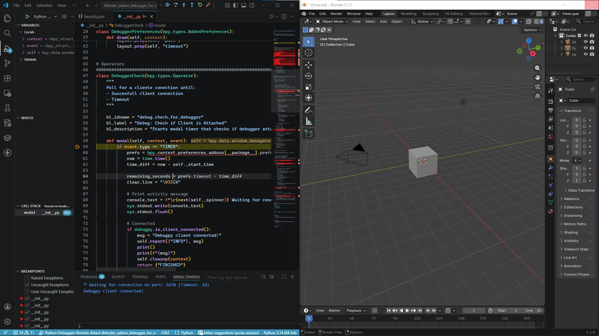
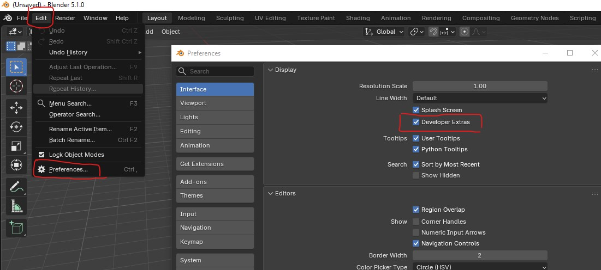
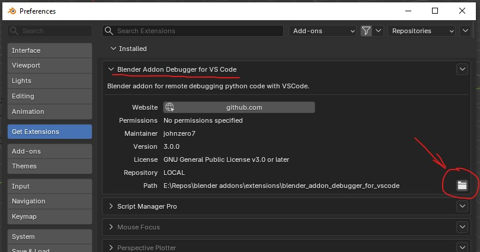
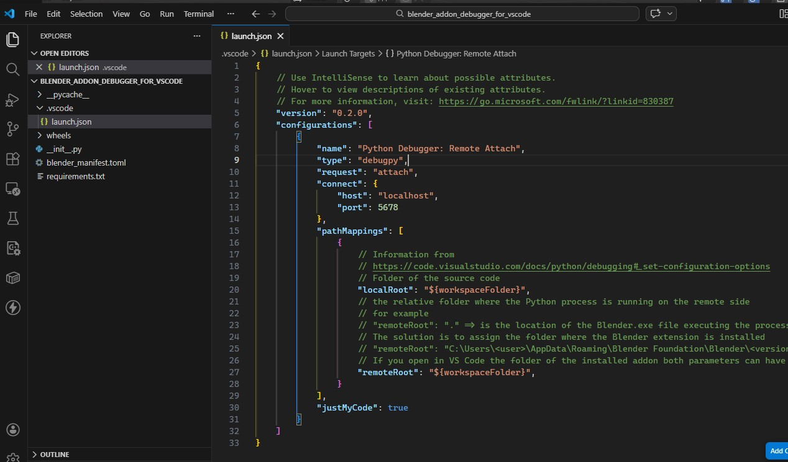
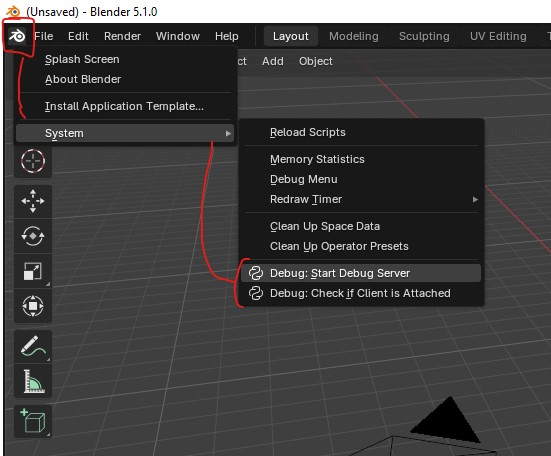
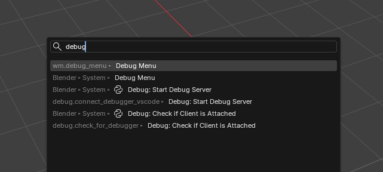
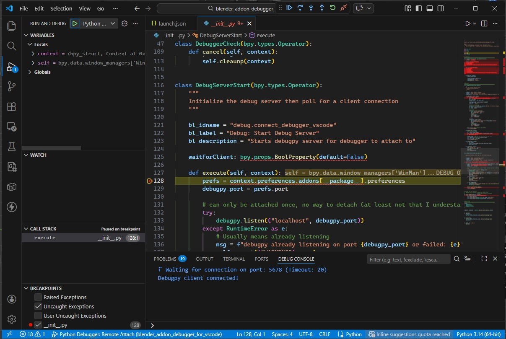
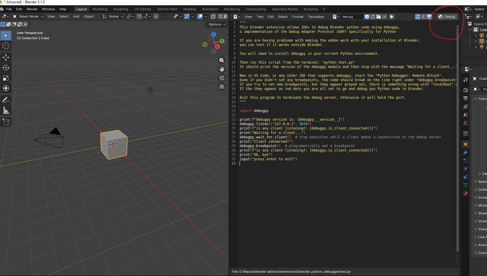

# Blender Python Debugger
A Blender extension, using **debugpy**, that lets you debug Python code using external DAP clients such as **VS Code**, **PyCharm**, **Zed**, etc. In this documentation we will use **VS Code** as an example, the steps should be similar in most IDEs.




## Why fork?
This fork adds compatibility with Blender's new extension system introduced in Blender 4.2.
That system allows dependencies such as debugpy to be bundled inside the extension package, simplifying installation.

## Inspiration / Credits
[Blender Python Debugger](https://github.com/johnzero7/blender-python-debugger) is **based on** [blender-debugger-for-vscode](https://github.com/alanscodelog/blender-debugger-for-vscode), which was **inspired by** [Blender-VScode-Debugger](https://github.com/Barbarbarbarian/Blender-VScode-Debugger).
That project was itself inspired by the [remote_debugger.py](https://github.com/sybrenstuvel/random-blender-addons/blob/master/remote_debugger.py) for PyCharm, as explained in the [Blender Developer's Blog post](https://code.blender.org/2015/10/debugging-python-code-with-pycharm/).

## What can it do
- Debug installed addons
- Debug standalone Python scripts
- Debug Blender Python source code
- Set breakpoints and step through addon and script execution
- Check whether a debugger client is attached to Blender

## Limitations
- Does not execute Python scripts directly from an IDE into Blender.

## Requirements
- **Blender 4.2** or higher
- **An IDE with DAP support** such as VS Code, PyCharm, Zed, etc.
- **debugpy** (bundled with the extension)

# How to Use

### Step 1: Install the extension
Go to the releases page and download the package for your Blender version and platform.

Starting with Blender 4.2, Blender extensions can bundle dependencies. This extension includes the debugpy package (https://pypi.org/project/debugpy/).

### Step 2: Enable Developer Extras
By default, Blender hides developer/debug options.
Go to **Edit → Preferences → Interface** and enable **Developer Extras**.



### Step 3: Locate the code to debug

**Extensions (Blender 4.2+)**
Go to **Edit → Preferences → Extensions**, expand **Blender Addon Debugger**, and click the **folder icon** to open the extension installation folder.



**Legacy addons**
If you are using an older addon, check the **Add-ons** tab.

**Standalone scripts**
The script must be in a folder Blender can access so it can be opened in the Text Editor.

**Blender Python source**
Open the Blender installation folder where `Blender.exe` resides and navigate to the current Blender version folder, then open the `scripts` subfolder. For example `C:\Program Files\Blender Foundation\Blender 4.2\4.2\scripts`

### Step 4: Open the folder in VS Code
Open the folder containing your source code in VS Code.
Create a `launch.json` file in a `.vscode` folder if one does not exist.

Add this configuration for `Python Debugger: Remote Attach`:


```json
{
    "name": "Python Debugger: Remote Attach",
    "type": "debugpy",
    "request": "attach",
    "connect": {
        "host": "localhost",
        "port": 5678
    },
    "pathMappings": [
        {
            "localRoot": "${workspaceFolder}",
            "remoteRoot": "${workspaceFolder}"
        }
    ]
}
```

Key settings:
- **host**: `localhost` (Host of the debug server where Blender is running)
- **port**: `5678` (must match the port in Blender's addon preferences)
- **localRoot**: source code folder of the project (This is the code we edit)
- **remoteRoot**: executing code folder (This is the code Blender is executing)
If Blender is running locally both folders should be the same.
In VS Code the default value for `"remoteRoot"` is `"."`, we need to change it to `"${workspaceFolder}"`.

### Step 5: Start the debug server
In Blender, open the menu under the Blender icon and choose **System**.

You will see:
- **Debug: Start Debug Server**
: Starts the debug server on the selected port and waits for a connection.
- **Debug: Check if Client is Attached**
: Checks whether a client is attached until a connection is made or the timeout expires.

Notes:
- The debug server can only be started once and remains running after that.
- As of 5/3/2022, debugpy has no method to stop the debug server. The only way to stop it is to close the process that started it (`Blender.exe`).


We can also find them in the search tool


### Step 6: Attach VS Code
In VS Code, open the **Run & Debug** tab, select **Python Debugger: Remote Attach**, and start the session with the green arrow or `F5`.

### Step 7: Set breakpoints and debug
Place a breakpoint in your Python code. For example, in `__init__.py` set one on the first line inside the `execute` method of `DebugServerStart`.

When you run that operator in Blender, Blender should pause and VS Code should stop at the breakpoint.




# Setup

Blender currently has two systems to extend functionality: legacy Addons and the new Extensions system.

### Addons (legacy)
The default addon folder is:

```
C:\Users\<USER>\AppData\Roaming\Blender Foundation\Blender\4.2\scripts\addons
```

To use a custom addon folder, go to **Edit > Preferences > File Paths > Script Directories** and add the parent path to your development folder (for example `C:\Code\Blender Stuff`).

The folder structure must include an `addons` subfolder:

```
...
└── Blender Stuff
    └── addons          <-- *Important*
        ├── your-addon-folder
        │   ├── __init__.py
        │   └── ...
        ├── another-addon
        └── ...
```

Important: Blender will not recognize addons that are not placed inside the `addons` folder. Do not include `addons` in the File Paths configuration.

See [Blender Docs — User-Defined Add-on Path](https://docs.blender.org/manual/en/latest/editors/preferences/addons.html#:~:text=Add%20a%20subdirectory%20under%20my_scripts%20called%20addons%20(it%20must%20have%20this%20name%20for%20Blender%20to%20recognize%20it)) for details.

### Extensions (new system)
The default extension folder is:

```
C:\Users\<USER>\AppData\Roaming\Blender Foundation\Blender\4.2\extensions\<repo>
```

To add a custom extension repository, go to:

`Edit > Preferences > Get Extensions > Repositories > + > Add Local Repository`

Set a repository name (for example `MyExtensions`), enable **custom folder**, and enter a path such as `C:\Code\Blender Stuff\extensions`.

The folder structure should match Blender's default extension layout:

```
...
└── Blender Stuff
    └── extensions
        ├── your-extension-folder
        │   ├── __init__.py
        │   ├── blender_manifest.toml
        │   └── ...
        ├── another-extension
        └── ...
```

See [Blender Docs — Installing Extensions](https://docs.blender.org/manual/en/latest/editors/preferences/extensions.html#installing-extensions).

Blender does not support duplicate addons/extensions. Remove duplicates so only one copy remains.

### Standalone Scripts
Standalone Python scripts can be debugged from Blender's Text Editor.
Open the script and click the **Debug** button to execute it with the debugger attached.



# Useful tips

### Editing Source Code while debugging

If you modify addon files while the debugger is running, Blender won't automatically detect the changes. You need to manually reload the scripts.

**For Standalone Scripts:**
Edit the code, only the changes saved to disk will have effect, then click the **Debug** button to run the script.

**For Addons:**
You must force Blender to reload the Python code:
In the menu, click the Blender icon and select **System → Reload Scripts** (or search for "Reload Scripts"). This reloads all Python code.

Python doesn't automatically re-import modules that are already loaded. If you've modified a module that other code imports, you need to manually reload it:
**Important Note:** Python doesn't re-import modules that are already loaded. This is a feature of Python. If you modify a submodule, reloading scripts won't update it. To force a reload of specific modules, use `importlib.reload()` in your code, or restart Blender entirely.

Example:

```
import sys
import importlib

if 'mymodule' in sys.modules:
    importlib.reload(mymodule)
import mymodule

```
You only need to reload modules if you modify the code.


### Blender Python API
You might encounter VS Code errors for `import bpy` and lack of autocompletion for Blender functions. This happens because `bpy` is not a standard Python module, it's an API providing Python access to Blender's C/C++ code. You cannot run Python code that imports `bpy` outside of Blender.

To resolve this, install the [fake-bpy-module](https://pypi.org/project/fake-bpy-module) package. This provides type hints and autocompletion for the Blender API.

## Advanced Usage

### Wait for Debugger Client

By default, the debug server starts immediately and listens for a client connection. However, you can make the server wait for a client to connect before continuing execution. This is useful for debugging startup code or when running Blender in headless mode.

To enable this, call:

```python
bpy.ops.debug.connect_debugger_vscode(waitForClient=True)
```

#### Running in Headless Mode

First make sure the addon is installed, enabled, and works when you run Blender normally.

Blender can then be run in background mode with the `-b/--background` switch (e.g. `blender --background`, `blender --background --python your_script.py`).

See [Blender Command Line](https://docs.blender.org/manual/en/latest/advanced/command_line/introduction.html).

You can detect when blender is run in background/headless mode and make the debugger pause and wait for a connection in your script/addon:

```python
if bpy.app.background:
	bpy.ops.debug.connect_debugger_vscode(waitForClient=True)
```

This will wait for a connection to be made to the debugging server. Once this is established, the script will continue executing and VS Code should pause on breakpoints that have been triggered.


# Troubleshooting

To determine whether the problem is on Blender's side or on the editor's side: Close Blender, install debugpy manually in the Python environment, and run this [test script](https://github.com/AlansCodeLog/blender-debugger-for-vscode/blob/master/test.py). You can copy/download it or run it from the addon folder. Execute it with `python test.py` and then try to connect to the server with your editor.

# Notes About IDEs
In some IDEs, like PyCharm, when you stop/rerun the client connection it also kills
the subprocess running in the remote debug server.
As a consequence you will not be able to reconnect to the remote server, because the subprocess is dead. And you will not be able to start a new remote server because internal flags still think the subprocess exists.
In some cases it will even kill the Blender process. So be careful not to stop/rerun the connection.
The only solution for now is to restart Blender.

Of all the IDEs I tested, VS Code reliably maintains the connection and does not kill the remote process when stopping or restarting the debugger.


# Downloading and Building

Download the appropriate version from the releases page for your Blender version and platform.

If you download or clone the repository, you will need to build the package by running **build_release.py**. This script downloads the dependencies (debugpy) and generates platform-specific packages.


